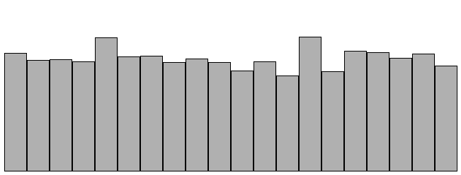

# randomdist

A random distribution sketch based on an example in the book Nature of Code.

## Online Example

An online example can be found [here](http://inchingforward.github.io/nc/randomdist/).

## To Run

1. run `lein fighweel`
2. Open index.html

