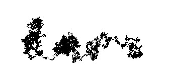

# walker

A walker sketch based on an example in the book Nature of Code.

A Random Walker after 10 minutes of walking.

## Online Example

An online example can be found [here](http://inchingforward.github.io/nc/).

## To Run

1. run `lein fighweel`
2. Open index.html

